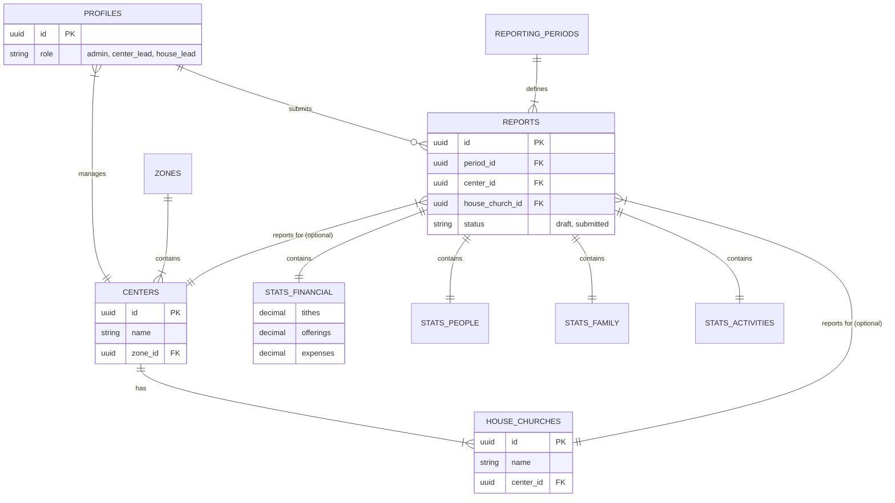

# IFA Database Design & Operational Model (2025-2026)

## 1. Executive Summary
This document outlines the database architecture for **Integrity For All (IFA)**. The design is optimized for **Supabase (PostgreSQL)** and supports the organization's requirement for monthly statistical reporting across its hierarchy (Centers and House Churches).

### Key Features
*   **Hierarchy Management**: Explicit tracking of Zones > Centers > House Churches.
*   **Monthly Reporting**: Aggregated statistics (Financial, People, Family, Impact) rather than raw transactional data, preserving privacy and simplifying data entry.
*   **Role-Based Access**: Integrated with Supabase Auth to ensure Leaders only access their relevant scope.
*   **Historical Analysis**: Capable of generating the "2025 Annual Report" metrics and extensible for future years.

---

## 2. Entity-Relationship Diagram (ERD)



---

## 3. Data Dictionary

### A. Organization
| Table | Description | Key Attributes |
|-------|-------------|----------------|
| `zones` | Geographic or administrative regions (e.g., Douala Nord). | `name`, `region` |
| `centers` | Main worship locations (e.g., Akwa, Bonamoussadi). | `name`, `zone_id`, `founded_date` |
| `house_churches` | Smaller cells/assemblies attached to a center. | `name`, `center_id`, `zone_area` |

### B. Reporting Core
| Table | Description | Key Attributes |
|-------|-------------|----------------|
| `reporting_periods` | Defines standard timeframes (e.g., Jan 2025). | `start_date`, `end_date`, `is_locked` |
| `reports` | The "Header" for a monthly submission. Links a specific period to a Center OR House Church. | `period_id`, `status`, `submitted_at` |

### C. Statistics & Data Mapping (The "Facts")
This section explains **where** each data category from the Annual Report is stored and **why** we chose this structure.

We use a **Vertical Partitioning** strategy: instead of one massive table with 50+ columns, we split the data into four logical domains (`Financial`, `People`, `Family`, `Activities`). 

**Why this approach?**
1.  **Security**: We can strictly limit who sees `stats_financial` (e.g., only Center Leads) while allowing House Leads to update `stats_people`.
2.  **Usability**: The data entry form can be split into four clean steps/tabs, reducing cognitive load for the user.
3.  **Scalability**: If we add a new category (e.g., "Digital Stats") in 2026, we simply add a new table without disrupting the existing ones.

---

#### 1. Financial Metrics (`stats_financial`)
*   **Source in Annual Report**: "Investir pour le Royaume" (Income Structure & Expenses).
*   **Goal**: Generate the financial pie charts and bar graphs (e.g., "Charge totale", "Structure du revenu").
*   **Data Mapping**:
    *   `tithes` -> **Dîmes** (74.8% of income).
    *   `offerings_general` -> **Offrandes courantes**.
    *   `offerings_events` -> **Offrandes évènements** (Special fundraising).
    *   `expense_mission` -> **Mission expenses** (10% contribution).
*   **Rationale**: By storing these as monthly aggregates per Center, we can instantly calculate year-to-date totals without processing thousands of individual transaction records.

#### 2. People & Growth (`stats_people`)
*   **Source in Annual Report**: "Gagner les perdus à Christ" & "Occuper le territoire".
*   **Goal**: Track the "+2.49% Growth" and "Churn" metrics.
*   **Data Mapping**:
    *   `new_converts` -> **Gagner les perdus** (New souls won).
    *   `members_active_start` + `members_gained` - `members_lost` -> **Net Growth & Churn**.
    *   `attendance_total` -> **Effectifs des disciples actifs**.
*   **Rationale**: Separating "Headcount" (Attendance) from "Membership Flow" (Gained/Lost) allows us to detect when people are attending but not becoming members, or vice versa.

#### 3. Family Health (`stats_family`)
*   **Source in Annual Report**: "Renforcer la famille".
*   **Goal**: Monitor social stability metrics like Marriages and Births.
*   **Data Mapping**:
    *   `marriages` -> **Mariages** (Target: 10).
    *   `couples_counseled` -> **Conseillers formés / Suivi**.
    *   `births` -> **Naissances**.
*   **Rationale**: These are distinct "Lifecycle Events" that don't fit into standard attendance or financial buckets. Keeping them separate highlights their importance as a strategic pillar.

#### 4. Activities & Impact (`stats_activities`)
*   **Source in Annual Report**: "Equiper les saints" & "Luire dans la société".
*   **Goal**: Measure the *effort* (inputs) and *social impact* (outputs).
*   **Data Mapping**:
    *   `people_trained` -> **Formation** (Certification des pasteurs, E-learning).
    *   `social_actions_count` -> **Oeuvres Sociales** (Target: 1 action/quarter).
    *   `youth_mentored` -> **Encadrement des Jeunes**.
*   **Rationale**: These metrics are often qualitative or event-based. Grouping them allows us to track "Mission Accomplishment" separately from "Church Growth."

---

## 4. Implementation Strategy (Supabase)

### Row Level Security (RLS)
Security policies will strictly enforce access based on the `profiles.role`:
*   **Admins**: Full `SELECT/INSERT/UPDATE/DELETE` on all tables.
*   **Center Leaders**: 
    *   Can view/edit `reports` where `center_id` matches their assignment.
    *   Can view `house_churches` belonging to their Center.
*   **House Leaders**:
    *   Can only view/edit `reports` for their specific `house_church_id`.

### Extensibility for 2026+
*   **New Metrics**: If 2026 introduces "Online Viewers", simply add a column `online_viewers` to `stats_people` or create a new `stats_digital` table linked to `reports`.
*   **Historical Data**: The `reporting_periods` table allows seamless year-over-year comparison (e.g., `WHERE fiscal_year = 2025` vs `2026`).

### Automation & Aggregation
To generate the **Annual Report**, a SQL view can be created:
```sql
CREATE VIEW annual_report_2025 AS
SELECT 
    c.name as center_name,
    SUM(sf.tithes) as total_tithes,
    SUM(sp.new_converts) as total_converts,
    SUM(sfam.marriages) as total_marriages
FROM reports r
JOIN stats_financial sf ON r.id = sf.report_id
JOIN stats_people sp ON r.id = sp.report_id
JOIN stats_family sfam ON r.id = sfam.report_id
JOIN centers c ON r.center_id = c.id
WHERE r.period_id IN (SELECT id FROM reporting_periods WHERE fiscal_year = 2025)
GROUP BY c.name;
```

---

## 5. Next Steps
1.  **Initialize Supabase Project**: Set up the project in the Supabase dashboard.
2.  **Run Migration**: Apply the schema definitions.
3.  **Seed Data**: Input the 2025 baseline data from the PDF report to verify the model.
4.  **Build UI**: Create the dashboard forms for leaders to submit monthly stats.
