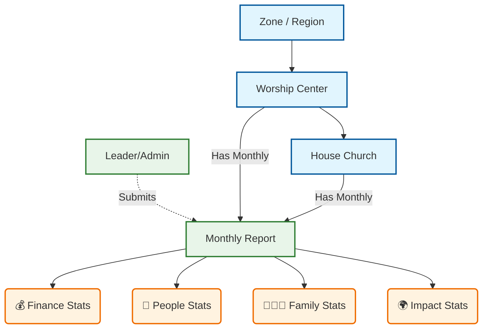

# IFA Database Model: Simplified View

This document translates the technical database schema into a visual guide for business stakeholders. It shows **what** we store and **how** it connects, using plain language instead of code.

## 1. High-Level Visual Map

This diagram shows the "Big Picture" of how our system is connected.

---

## 2. Data "Buckets" (Tables)

We store data in separate "Buckets" (Tables) to keep things organized. Here is what is inside each bucket.

### A. Organization Bucket
*Where we store the list of our locations.*

| Bucket Name | What's Inside? | Example Data |
| :--- | :--- | :--- |
| **Locations (Centers)** | Name of the Center, Date Founded, Address. | "Center Akwa", "Founded 2012" |
| **Sub-Locations (Cells)** | Name of the Cell, Host Name, Neighborhood. | "Cellule Espoir", "Chez M. Talla" |
| **Users (Profiles)** | Name, Role (Admin/Leader), Assigned Center. | "Pastor John", "Center Leader" |

---

### B. The "Monthly Report" Bucket
*This is the main folder for every month's data.*

| Field Name | Description | Why? |
| :--- | :--- | :--- |
| **Period** | The Month & Year (e.g., Jan 2026). | To organize history. |
| **Submitted By** | Who sent this report? | For accountability. |
| **Status** | Draft, Submitted, or Approved. | To know if it's ready for review. |

---

### C. The 4 Statistics Buckets
*These are the detailed forms attached to every Monthly Report.*

#### 1. 💰 Finance Bucket (Confidential)
*Only visible to Center Leaders & Admins.*

| Field | Description |
| :--- | :--- |
| **Tithes** | Total 10% contributions collected. |
| **Offerings** | General Sunday collections. |
| **Event Seeds** | Special fundraising for events. |
| **Expenses** | Money spent on Rent, Admin, Missions. |

#### 2. 👥 People Bucket (Growth)
*Tracking the flock.*

| Field | Description |
| :--- | :--- |
| **Attendance** | Count of Men, Women, Children (Total). |
| **New Souls** | Number of people who accepted Christ. |
| **Baptisms** | Number of water baptisms held. |
| **Churn** | Number of members who left/relocated. |

#### 3. 👨‍👩‍👧 Family Bucket (Society)
*Tracking social milestones.*

| Field | Description |
| :--- | :--- |
| **Marriages** | Weddings celebrated this month. |
| **Births** | New babies born. |
| **Counseling** | Number of couples/people counseled. |

#### 4. 🌍 Impact Bucket (Activities)
*Tracking our work.*

| Field | Description |
| :--- | :--- |
| **Training** | Number of people in Bible School. |
| **Social Actions** | Number of charity events (meals, visits). |
| **Youth Mentoring** | Number of young people being mentored. |

---

## 3. How Connections Work

*   **One-to-Many**: One **Center** has many **House Churches**. (Like a Mother with many Children).
*   **One-to-One**: One **Report** has exactly one **Finance Sheet**. (They are stapled together).
*   **Link**: A **User** is linked to a **Center**. When they log in, the system checks this link to decide what data to show them.
